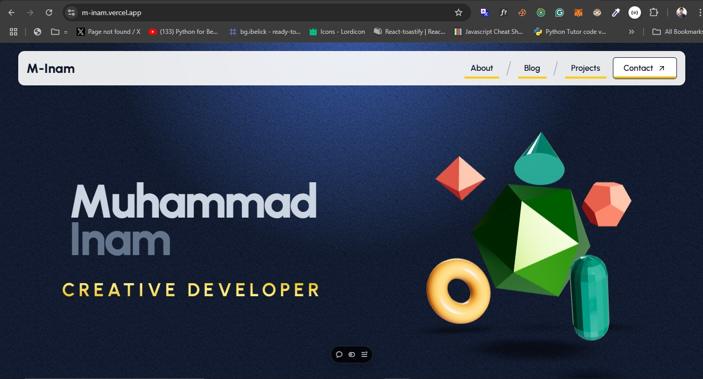
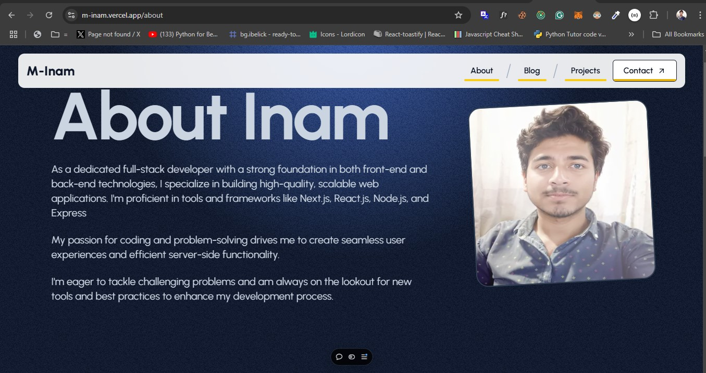
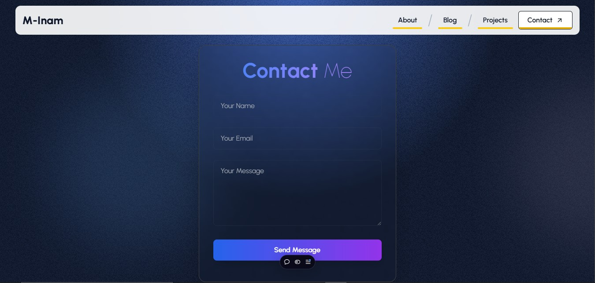
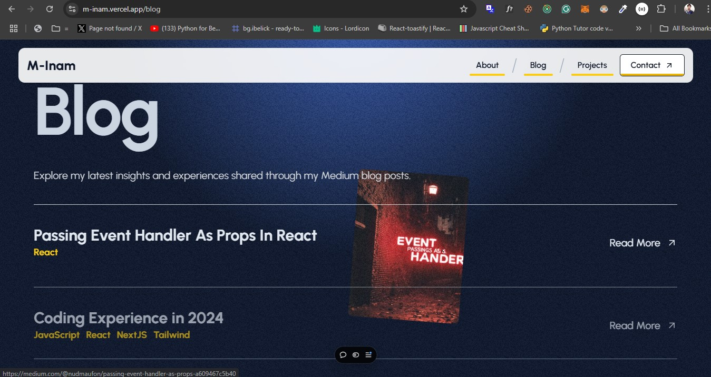

# My Creative Portfolio

A modern, interactive portfolio website built with Next.js, featuring a stunning UI and seamless user experience.

## 📸 Portfolio Showcase

### Home Page

*Modern and interactive home page with stunning animations*

### About Page

*Modern and interactive home page with stunning animations*

### Contact Section

*Professional about section showcasing skills and experience*

### Blog Display

*Interactive project showcase with modern design*


## ✨ Features

- 🎨 Modern UI with glassmorphism effects
- 🌓 Dynamic animations and transitions
- 📱 Fully responsive design
- 📧 Interactive contact form with email functionality
- 🚀 Fast loading and optimized performance
- 🎵 Sound effects for enhanced user experience

## 🛠️ Built With

- [Next.js 14](https://nextjs.org/) - React Framework
- [Tailwind CSS](https://tailwindcss.com/) - For styling
- [TypeScript](https://www.typescriptlang.org/) - Programming Language
- [Framer Motion](https://www.framer.com/motion/) - For animations
- [Nodemailer](https://nodemailer.com/) - For email functionality

## 🚀 Getting Started

1. Clone the repository:
```bash
git clone https://github.com/yourusername/my-creative-portfolio.git
```

2. Install dependencies:
```bash
npm install
```

3. Create a `.env.local` file in the root directory and add your email credentials:
```env
EMAIL_USER=your-email@gmail.com
EMAIL_PASS=your-app-password
```

4. Run the development server:
```bash
npm run dev
```

Open [http://localhost:3000](http://localhost:3000) to view the portfolio in your browser.

## 📁 Project Structure

```
my-creative-portfolio/
├── src/
│   ├── app/
│   │   ├── components/
│   │   ├── api/
│   │   └── pages/
├── public/
│   ├── image/
│   └── sounds/
└── styles/
```

## 🎯 Key Features Explained

### Interactive UI
- Glassmorphism effects with blur and transparency
- Smooth animations and transitions
- Dark theme optimized design

### Contact Form
- Real-time form validation
- Secure email sending functionality
- Interactive success/error notifications

### Performance
- Optimized images and assets
- Fast page loading
- Smooth animations and transitions

## 📝 Environment Variables

Required environment variables:

- `EMAIL_USER`: Your Gmail address
- `EMAIL_PASS`: Your Gmail app password

## 🚀 Deployment

This portfolio is deployed on [Vercel](https://vercel.com). For deployment:

1. Push your code to GitHub
2. Connect your repository to Vercel
3. Configure environment variables in Vercel dashboard
4. Deploy!

## 📄 License

This project is licensed under the MIT License.

## 🤝 Contact

For any queries or suggestions, feel free to reach out through the contact form on the portfolio website.

---
*Made with ❤️ using Next.js and Tailwind CSS*
